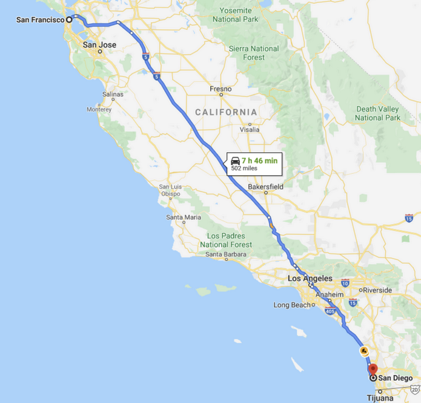

# Dynamic Programming
### What is Dynamic Programming?

Consider the problem of the shortest driving path from San Francisco (SF) to San Diego (SD). Since the highway goes through Los Angeles (LA), the problem can be divided into two sub-problems - driving from SF to LA and driving from LA to SD. 

In addition, **shortest_path(SF, SD) = shortest_path(SF, LA) + shortest_path(LA, SD)**. Optimal solution to the problem = combination of optimal solutions of the sub-problems.



Now let’s look at an example where the problem does NOT have an optimal substructure. Consider buying the cheapest airline ticket from New York (NYC) to San Francisco (SF). Let’s assume there is no direct flight, and we must transit through Chicago (CHI). Even though our trip is divided into two parts, NYC to CHI and CHI to SF, usually the cheapest ticket from NYC to SF != the cheapest ticket from NYC to CHI + the cheapest ticket from CHI to SF because airlines do not generally price multi-leg trips as the sum of each flight's cost to maximize profit.

**So it is a simple concept of solving bigger problems using smaller problems while saving results to avoid repeated calculations.**

A problem is a dynamic programming problem if it satisfies two conditions:
+ The problem can be divided into sub-problems, and its optimal solution can be constructed from optimal solutions of the sub-problems. In academic terms, this is called optimal substructure.
+ The sub-problems from 1 or more overlap.

**DP == DFS + memoization + pruning**

### Approaches of Dynamic Programming
1. Top-down: This is basically DFS + memoization, as we have seen in the memoization section. We split large problems and recursively solve smaller sub-problems.

2. Bottom-up: We try to solve sub-problems and then use their solutions to find the solutions to bigger sub-problems. This is usually done in a tabular form.


### 1. Top-Down with Memoization
Recall that we have a system for backtracking and memoization.
+ Draw the tree: see the tree above
+ Identify states
+ What state do we need to know if we have reached a solution? We need to know the value of n we are computing.
+ What state do we need to decide which child nodes to visit next? No extra state is required. We always visit n-1 and n-2.
+ DFS + pruning (if needed) + memoization
```py
def fib(n, memo):
    if n in memo: # check for the solution in the memo, if found, return it right away
        return memo[n]

    if n == 0 or n == 1:
        return n

    res = fib(n - 1, memo) + fib(n - 2, memo)

    memo[n] = res # save the solution in memo before returning
    return res

OR

def fib(n):
    memo = {}
    def recursive(n):
        if n <= 1:
            return 1
        if n not in memo:
            memo[n] = recursive(n - 1) + recursive(n - 2)
        return memo[n]
    return recusrive(n)

```


### 2. Bottom-up with Tabulation
For bottom-up dynamic programming, we first want to start with the sub-problems and work our way up to the main problem. This is usually done by filling up a table.

For the Fibonacci problem, we want to fill a one-dimensional table dp, where each entry at index i represents the value of the Fibonacci number at index i. The last element of the array is the result we want to return.

The order of filling matters because we cannot calculate dp[i] without dp[i - 1] and dp[i - 2].

```py
def fib(n):
    dp = [0, 1]
    for i in range(2, n + 1):
      dp.append(dp[i - 1] + dp[i - 2])

    return dp[-1]
```
The formula dp[i] = dp[i - 1] + dp[i - 2] is called the recurrence relation. It is the key to solving any dynamic programming problem.

For the Fibonacci number problem, the relation is already given dp[i] = dp[i - 1] + dp[i - 2]. We will discuss the patterns of recurrence relation in the next section.


## Should I do top-down or bottom-up?
Top-down Pros:
+ The order of computing sub-problems doesn't matter. For bottom-up, we have to full the table in order to solve all the sub-problem first. For example, to fill `dp[8]`, we have to full `dp[6]` and `dp[7]` first. For top-down, we can let recursion and memoization take care of the sub-problems and, therefore, not worry about the order.

Bottom-up Pros:
+ Easier to analyze the time complexity (since it's just the time to fill the table)
+ No recursion, and thus no system stack overflow, although not a huge concern for normal coding interviews.

From our experiences, top-down is often a better place to start unless it's clear what order the states should be filled in (e.g. grid dp problems).

## When to use Dynamic Programming?
Mathematically, DP is an optimization method on one or more sequences (e.g, arrays, matrices). So questions asking about the optimal way to do something on one or more sequences are often a good candidate for DP. Typically, DP problems will ask for one of the following:
+ The **maximum/longest, minimal/shortest value/cost/profit** you can get from doing operations or a sequence.
+ How many ways there are to do something. This can often be solved by DFS + memoization, i.e, top-down Dynamic Programming
+ Is it posisble to accomplish something better? Often this kind of problem will ask you to return a boolean.

## How to Develop Intuition for Dynamic Programming Problems
As you may have noticed, the concept of DP is quite simple—find the overlapping sub-problems, solve them, and use the sub-problem solutions to find the solution to the original problem. The hard part is to know how to find the **recurrence relation**. To best way to develop intuition is to get familiar with common patterns. Some classic examples include longest common subsequence (LCS), 0-1 knapsack, and longest increasing subsequence (LIS).

## How to think a problem of Dynamic Programming?
[](DP_howToThink.md)

## Different Approach
[](DP_pattern.md)